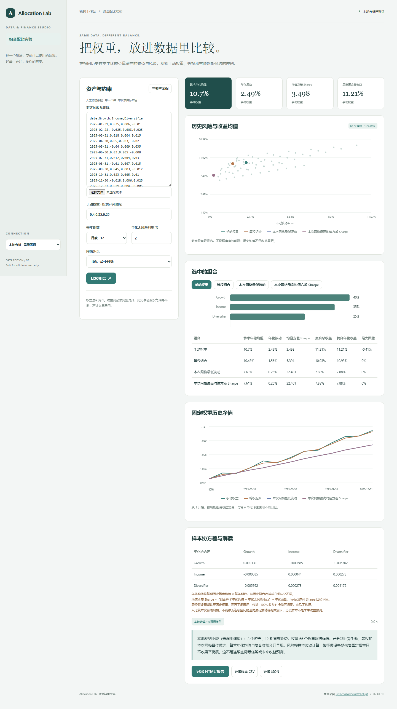

# Allocation Lab

在相同历史样本中比较少量资产的收益与风险，观察手动权重、等权和有限网格候选的差别。

- 2–4 个资产的完整对齐收益矩阵
- 算术年化均值与样本协方差
- 10% / 5% 步长的有限权重网格
- 风险收益散点、历史净值与权重报告



## 快速开始

需要 Node.js 24 或更新版本；无第三方运行依赖，无需 npm install。

```sh
git clone https://github.com/Yiwen-Yang-BA/chatgpt-allocation-lab.git
cd chatgpt-allocation-lab
npm start
```

打开 http://127.0.0.1:3207 。默认进入**本地分析模式**，不调用 API；统计值由本地代码计算。示例数据为人工构造，界面明确标注。

### 接入真实模型

复制 `.env.example` 为 `.env`，填写 `OPENAI_API_KEY`，按账号权限设置 `OPENAI_MODEL`，然后重启服务并切换界面中的「AI 解读」。`OPENAI_BASE_URL` 必须支持 OpenAI Responses API；仅兼容 Chat Completions 的服务不适用。密钥只在服务端读取，不写入前端或仓库。

```sh
# Docker（可选；必须显式传入配置）
docker build -t chatgpt-allocation-lab .
docker run --rm -p 127.0.0.1:3207:3207 --env-file .env chatgpt-allocation-lab
```

## 使用方法

1. CSV 第一列使用 date，其余 2–4 列为资产小数收益率，缺失数据会被拒绝。
2. 按 CSV 中资产列顺序填写权重，以英文逗号分隔，总和须为 1。
3. 指定频率、年化无风险利率和搜索步长，运行比较。
4. 选择组合查看权重和净值；网格候选是历史比较，不是未来配置建议。

## 计算口径

所有资产使用相同日期、币种和频率；至少两行，拒绝缺失，不补零；简单收益率范围 [-1,10]。mu=f×单期平均收益，年化协方差=f×样本协方差（分母n−1）；组合算术年化均值=w·mu，波动=sqrt(wᵀΣw)；均值方差 Sharpe=(w·mu−年化无风险利率)/波动，零波动未定义。这不是收益序列按单期无风险利率计算的 Sharpe，也不是 CAGR。另行计算逐期固定权重组合的复合收益与净值，假设每期恢复权重且不收费。只做多、权重和1，网格按10或20等份整数枚举（10%或5%步长）；本次网格内最低波动/最高Sharpe不等于连续空间全局最优或精确有效前沿。不使用协方差逆矩阵，可处理奇异矩阵；未实现收缩估计。参考 [PyPortfolioOpt 风险模型](https://pyportfolioopt.readthedocs.io/en/latest/RiskModels.html) 与 [收益估计](https://pyportfolioopt.readthedocs.io/en/latest/ExpectedReturns.html)，本项目显式选择算术年化均值。

## 验证

```sh
npm run check
npm test
```

测试覆盖业务规则以及本地 HTTP 服务、模拟模型接口、输入校验和错误处理。真实付费模型调用需要用户配置有效密钥，未将本地分析测试作为真实模型质量验证。GitHub Actions 在每次推送时运行检查。

## 参考与复刻范围

灵感来自 [PyPortfolio/PyPortfolioOpt](https://github.com/PyPortfolio/PyPortfolioOpt)（MIT）。查询快照：2026-10-04；6,071 stars；最近推送 2026-07-07。这是当前星标量与更新状态，**不是近一个月新增星标排名**。

本仓库是对其核心交互和用途的独立轻量实现，未复制上游源码、商标或静态资源，不声称实现上游的全部功能，也不属于上游官方产品。

独立复刻少量资产的历史组合分析：日期对齐、收益协方差、手动权重与等权等基准、历史风险收益比较和有限候选权重搜索。明确优化方法与约束，不将有限搜索宣称全局最优，不包含 Black-Litterman 或专业求解器，不把历史最优当作未来配置建议。

## 模型接收的数据

模型接收参数、资产名称和选中组合的权重与汇总指标，不接收逐期收益矩阵、协方差矩阵、完整网格或净值路径。

## 数据与部署边界

输入与计算结果仅在当前页面使用，无券商连接或自动调仓。 本地分析数据不离开本机；AI 解读仅发送本项目 README 说明的统计摘要到所配置的模型服务。

默认只监听 127.0.0.1，适用于单人本地使用；没有多用户登录或持久数据库。如需公网部署，请先增加身份验证、配额和 HTTPS。服务限制请求大小、并发和超时，禁止从静态目录读取密钥文件。

接口实现依据 [OpenAI 官方文本生成文档](https://developers.openai.com/api/docs/guides/text)。

## License

MIT — independent implementation.
